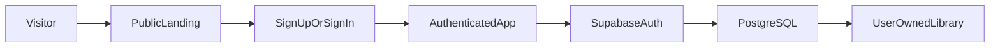
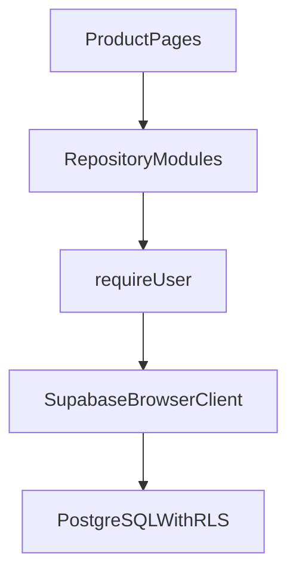
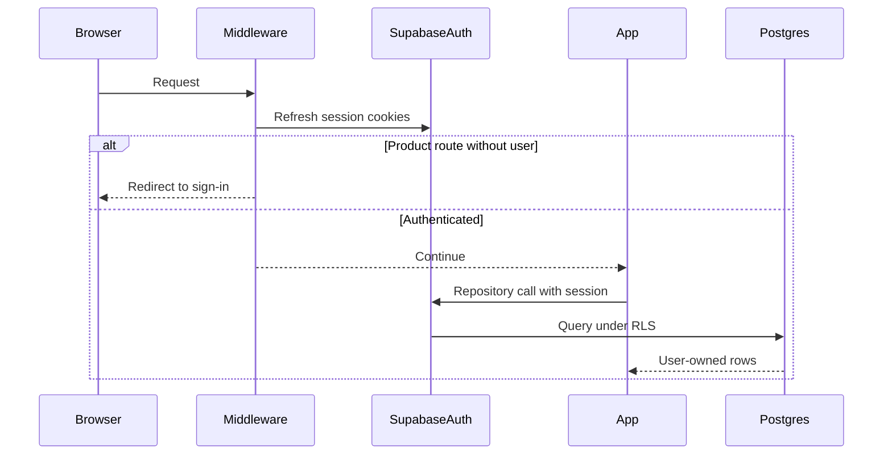

# Alostra authentication & persistence architecture

**Status:** implemented; awaiting review freeze.  
**Source of truth:** this file documents the only approved authentication and
persistence architecture for Alostra Version 1.

Earlier drafts that described dual persistence, device-local libraries, or
client-side database adapters are obsolete and must not guide implementation.

---

## 1. Product philosophy

Alostra is the private home for everything a user reads.

It unifies books, articles, captures, and notes into one continuous reading
experience, regardless of where the actual reading takes place.

**Books are tracking records only.** Alostra stores:

- metadata
- status
- progress
- captures
- notes
- reflections

Alostra does **not** store EPUB, PDF, or full-book binaries. Do not add
full-book file storage in Version 1.

Milestone 1 (design system) and Milestone 2 (component library) APIs remain
frozen. This architecture must not change those component contracts.

---

## 2. Authentication philosophy

Accounts exist so a user’s reading home is durable and available across
devices.

- The product library requires an authenticated session.
- Public visitors may see a calm marketing landing page and auth flows without
  an account.
- Email and password are sufficient for Version 1.
- Language stays quiet and useful: create an account to protect and carry the
  reading home—not to unlock a flashy SaaS funnel.

Do **not** introduce:

- aggressive SaaS onboarding
- social login (unless explicitly approved later)
- gamification
- unrelated onboarding screens
- anonymous persistent libraries

---

## 3. High-level architecture

```text
Visitor
  → public landing page
  → Sign up / Sign in
  → authenticated Alostra application
  → Supabase Auth
  → Supabase PostgreSQL
  → user-owned books, articles, captures
```



**Rules**

- Supabase PostgreSQL is the **only** canonical application database.
- Every library row belongs to `auth.users` via `user_id`.
- There is one persistence path: authenticated client → Supabase → PostgreSQL.
- There is no second client database for library data in Version 1.
- If offline support is added later, any browser cache must sit **behind**
  Supabase as source of truth—not beside it.

---

## 4. Supabase Auth architecture

### Provider

- Supabase Auth with email + password.
- Browser and server clients from `@supabase/ssr` and `@supabase/supabase-js`.
- Public env: `NEXT_PUBLIC_SUPABASE_URL`, `NEXT_PUBLIC_SUPABASE_ANON_KEY`.
- Never expose the service-role key to the browser or client bundles.

### Clients

| Client | Location | Role |
|---|---|---|
| Browser | `src/lib/supabase/client.ts` | Client components, repositories, auth forms |
| Server | `src/lib/supabase/server.ts` | Server Components, Route Handlers |
| Middleware | `src/lib/supabase/middleware.ts` | Session refresh + route gating |

### Auth surfaces

| Route | Purpose |
|---|---|
| `/sign-up` | Create account |
| `/sign-in` | Sign in |
| `/forgot-password` | Request password reset email |
| `/auth/callback` | Exchange auth code / confirm links |
| `/auth/reset-password` | Set a new password after recovery |

### Auth UI rules

- Use frozen Milestone 2 primitives (`Button`, `Input`, `SectionHeading`, etc.).
- Calm copy only.
- After successful sign-in or sign-up (when a session exists), enter the
  authenticated product (default `/home`).
- Password recovery uses Supabase email links that land on `/auth/callback`
  and then `/auth/reset-password` as configured in the Supabase project.

### Configuration failure

If Supabase env vars are missing, the app must **not** invent a local library.
Marketing may still render. Auth and product routes must fail clearly
(configuration required).

---

## 5. PostgreSQL schema

Migrations (apply in order):

1. `supabase/migrations/20260807000000_library_rls.sql` — schema, indexes,
   constraints, and RLS policies.
2. `supabase/migrations/20260808000000_grant_authenticated_library.sql` —
   table privileges (`SELECT`/`INSERT`/`UPDATE`/`DELETE`) for the
   `authenticated` role.

These migrations remain valid under the SaaS architecture. Schema and RLS do
not need redesign for this change.

### `books`

| Column | Type | Notes |
|---|---|---|
| `id` | `uuid` PK | Client-generated UUID |
| `user_id` | `uuid` NOT NULL | FK → `auth.users(id)` ON DELETE CASCADE |
| `title` | `text` NOT NULL | |
| `author` | `text` NOT NULL DEFAULT `''` | |
| `cover_url` | `text` | Optional |
| `status` | `text` | `want-to-read` \| `reading` \| `finished` |
| `current_page` | `integer` | Nullable; ≥ 0 |
| `total_pages` | `integer` | Nullable; > 0 |
| `progress_percent` | `integer` | 0–100 |
| `created_at` | `timestamptz` | |
| `updated_at` | `timestamptz` | |
| `last_opened_at` | `timestamptz` | Optional |

Index: `(user_id, updated_at DESC)`.

### `articles`

| Column | Type | Notes |
|---|---|---|
| `id` | `uuid` PK | |
| `user_id` | `uuid` NOT NULL | FK → `auth.users` |
| `title` | `text` NOT NULL | |
| `url` | `text` NOT NULL | |
| `author` | `text` | Optional |
| `site_name` | `text` | Optional |
| `status` | `text` | `saved` \| `reading` \| `finished` |
| `progress_percent` | `integer` | Nullable; 0–100 |
| `created_at` | `timestamptz` | |
| `updated_at` | `timestamptz` | |
| `last_opened_at` | `timestamptz` | Optional |

Index: `(user_id, updated_at DESC)`.

### `captures`

| Column | Type | Notes |
|---|---|---|
| `id` | `uuid` PK | |
| `user_id` | `uuid` NOT NULL | FK → `auth.users` |
| `book_id` | `uuid` | FK → `books`, nullable |
| `article_id` | `uuid` | FK → `articles`, nullable |
| `text` | `text` NOT NULL | Highlight / quote |
| `note` | `text` | Optional |
| `page_number` | `integer` | Optional; ≥ 0 |
| `created_at` | `timestamptz` | |
| `updated_at` | `timestamptz` | |

Constraint: exactly one of `book_id` or `article_id` is set.  
Indexes: `(user_id, updated_at DESC)`, `(user_id, book_id)`, `(user_id, article_id)`.

Books remain tracking records. No binary book storage tables.

---

## 6. Repository architecture (Supabase only)

### Principle

UI pages call thin repository modules. Repositories talk to Supabase with the
authenticated user’s session. Domain logic (validation, progress, search)
stays outside UI components.



### Modules

| Module | Responsibility |
|---|---|
| `src/lib/repositories/books.ts` | Book CRUD against `public.books` |
| `src/lib/repositories/articles.ts` | Article CRUD against `public.articles` |
| `src/lib/repositories/captures.ts` | Capture CRUD + `listWithSources` |
| `src/lib/repositories/library.ts` | Composed home/library queries |
| `src/lib/repositories/mappers.ts` | Row ↔ domain type mapping |
| `src/lib/repositories/types.ts` | Repository input/output types (no dual mode) |
| `src/lib/repositories/require-user.ts` | Resolve browser client + authenticated `userId` |

### `requireUser`

Every mutating or reading repository call that needs ownership context:

1. Create/get the browser Supabase client.
2. Resolve the current user (`getUser()`).
3. If no user, throw a clear authentication error (UI/middleware should have
   prevented this; repositories stay defensive).
4. Proceed with queries filtered by `user_id` (RLS still enforces).

### Explicit non-goals for the data layer

The following must not exist in the codebase after implementation:

- local / cloud repository folders as parallel adapters
- active library store binding
- persistence mode flags (`local` \| `cloud`)
- one-shot upload migrators
- per-user “already migrated” metadata
- anonymous device libraries

### IDs and timestamps

Keep shared helpers such as `src/lib/db/ids.ts` (`createId`, `nowIso`) for
UUID and ISO timestamps. That path may remain even after other `src/lib/db/*`
files are removed, or helpers may move later without changing behavior.

### Seed data

No automatic sample library seed in Version 1. Empty authenticated libraries
use existing empty states.

---

## 7. Route protection

### Public routes

| Path | Audience |
|---|---|
| `/` | Marketing landing |
| `/sign-in`, `/sign-up`, `/forgot-password` | Auth |
| `/auth/callback`, `/auth/reset-password` | Auth completion |
| `/dev/design-system` | Internal design catalogue |

### Authenticated product routes

| Path | Purpose |
|---|---|
| `/home` | Authenticated home (continue reading, recent, recent captures) |
| `/library`, `/library/*` | Library management |
| `/captures`, `/captures/*` | Captures |

### Middleware behavior

Middleware must:

1. Refresh the Supabase session (cookie write-through).
2. If the path is a product route and there is no user → redirect to
   `/sign-in?next=<original-path>`.
3. If the path is `/sign-in` or `/sign-up` and there is a user → redirect to
   `/home`.
4. Leave public marketing and auth-completion routes accessible.

### `next` parameter

- Accept only same-origin relative paths that target product routes
  (e.g. `/home`, `/library`, `/captures/...`).
- Reject absolute URLs, protocol-relative URLs, and unknown paths.
- Default post-auth destination: `/home`.

### App shell

- Product shell is for authenticated use.
- Navigation primary target for Home is `/home`.
- Signed-out product chrome (e.g. “Protect library” as a soft upsell) is
  removed; unauthenticated users never reach the product shell.
- Sign out clears the session and returns the user to `/` (landing).

---

## 8. Session lifecycle



1. **Sign up / sign in** — Supabase issues a session; `@supabase/ssr` stores it
   in cookies.
2. **Browser restart** — Middleware and server clients read cookies and refresh
   the session. The user remains signed in until expiry or sign-out.
3. **Navigation** — Middleware refreshes cookies on matched requests.
4. **Sign out** — `auth.signOut()` clears the session; next product navigation
   redirects to sign-in.
5. **AuthProvider** — Client context exposes `user`, `ready`, and sign-out for
   UI only. It does not select persistence backends.

Sessions are cookie-based. Do not store the library database in the browser
for Version 1.

---

## 9. Row Level Security strategy

RLS is enabled on `books`, `articles`, and `captures`.

### Ownership

For all three tables:

- `SELECT` / `INSERT` / `UPDATE` / `DELETE` require `auth.uid() = user_id`.

### Capture source integrity

On capture `INSERT` and `UPDATE`, `WITH CHECK` must ensure:

- `user_id = auth.uid()`, and
- if `book_id` is set, that book exists and `books.user_id = auth.uid()`, or
- if `article_id` is set, that article exists and
  `articles.user_id = auth.uid()`, and
- exactly one source is set (enforced by table constraint + policy).

Application code should mirror these rules for clear UX errors; **RLS remains
the authority**.

### Client trust model

- The anon key is public; security is session JWT + RLS.
- Middleware redirects are UX, not a security boundary.
- Never bypass RLS with a browser-exposed service role.

---

## 10. Security considerations

- Use only the anon key in client and middleware code.
- Validate post-login `next` redirects (open-redirect prevention).
- Do not send article text, highlights, notes, or titles to analytics.
- Do not log user reading content in Sentry.
- Do not bypass paywalled or authenticated third-party article sites.
- Password reset and magic links must use configured redirect allow-lists in
  the Supabase project (`/auth/callback`, `/auth/reset-password`).
- Cross-user data access must fail at the database even if a client bug omits
  a `user_id` filter.

### Development data warning

Any library data that today exists only in a browser device database from
earlier prototypes is outside this architecture. Removing obsolete client
persistence without an upload path will make that data inaccessible. Prefer
working against Supabase for all development libraries going forward.

---

## 11. Folder structure (target)

```text
src/
  app/
    (marketing)/          # public landing at /
      page.tsx
    (auth)/               # sign-in, sign-up, forgot-password
    (app)/                # authenticated product shell
      home/page.tsx
      library/...
      captures/...
    auth/
      callback/route.ts
      reset-password/page.tsx
    _components/
      app-shell.tsx
  lib/
    auth/
      auth-context.tsx    # session UI only
    supabase/
      config.ts
      client.ts
      server.ts
      middleware.ts
    repositories/
      require-user.ts
      types.ts
      mappers.ts
      books.ts
      articles.ts
      captures.ts
      library.ts
    domain/               # unchanged domain helpers
    db/
      ids.ts              # shared id/time helpers only
  middleware.ts           # session refresh + route gates

supabase/
  migrations/
    20260807000000_library_rls.sql
    20260808000000_grant_authenticated_library.sql
```

---

## 12. Files to create

| File | Purpose |
|---|---|
| `src/app/(marketing)/page.tsx` (or equivalent public `/`) | Calm landing |
| `src/app/(app)/home/page.tsx` | Authenticated home (moved from current `/`) |
| `src/lib/repositories/require-user.ts` | Authenticated client + `userId` |
| `src/lib/repositories/types.ts` | Supabase-only repository types |
| `src/lib/repositories/mappers.ts` | Relocated row mappers |
| Focused tests listed in §16 | Route gate / `requireUser` / cloud repository mocks |

Auth pages, Supabase clients, and the SQL migration may already exist from
prior work; create only what is missing after simplification.

---

## 13. Files to modify

| File | Change |
|---|---|
| `src/lib/repositories/books.ts` | Supabase CRUD only (absorb former cloud impl) |
| `src/lib/repositories/articles.ts` | Same |
| `src/lib/repositories/captures.ts` | Same |
| `src/lib/repositories/library.ts` | Keep composition; ensure callers are auth-gated |
| `src/lib/auth/auth-context.tsx` | Session-only; remove persistence binding |
| `src/middleware.ts` | Gate product routes; refresh session |
| `src/lib/supabase/middleware.ts` | Support redirects + safe `next` |
| `src/app/(app)/layout.tsx` | Authenticated shell; remove obsolete bootstrap |
| `src/app/_components/app-shell.tsx` | `/home` nav; signed-in product chrome; sign out → `/` |
| Auth pages | Redirect authenticated users to `/home` |
| `src/lib/domain/types.ts` | Comments: Supabase is SoT |
| `package.json` / lockfile | Remove obsolete client-DB packages |
| `src/test/setup.ts`, `vitest.config.mts` | Drop obsolete test polyfills |
| `docs/data.md`, `docs/ux-decisions.md`, `README.md`, `AGENTS.md` | Align with this document |

Frozen Milestone 1/2 component files under `src/components/**` should not need
API changes.

---

## 14. Files to delete

Delete all obsolete dual-persistence and device-library code, including:

| Path | Reason |
|---|---|
| `src/lib/db/database.ts` | Obsolete client database |
| `src/lib/db/database.test.ts` | Obsolete |
| `src/lib/db/seed.ts` | Obsolete sample seed |
| `src/lib/repositories/local/**` | Obsolete local adapters |
| `src/lib/repositories/cloud/store.ts` | Flattened away |
| `src/lib/repositories/cloud/books.ts` | Flattened into top-level repos |
| `src/lib/repositories/cloud/articles.ts` | Flattened |
| `src/lib/repositories/cloud/captures.ts` | Flattened |
| `src/lib/persistence/**` | Obsolete adapter binding |
| `src/lib/auth/bind-persistence.ts` | Obsolete |
| `src/lib/migration/**` | Obsolete |
| `src/app/_components/database-bootstrap.tsx` | Obsolete seed bootstrap |

After relocating mappers/ownership tests, remove empty `cloud/` leftovers.

Also remove the obsolete document formerly known as
`docs/auth-cloud-plan.md` once this file is the sole architecture SoT
(this rename/rewrite accomplishes that).

---

## 15. Dependencies to remove

| Package | Where | Action |
|---|---|---|
| `dexie` | `dependencies` | Remove |
| `fake-indexeddb` | `devDependencies` | Remove |

**Keep**

- `@supabase/supabase-js`
- `@supabase/ssr`

---

## 16. Tests

### Retain

- `src/lib/domain/progress.test.ts`
- `src/lib/domain/validation.test.ts`
- `src/lib/domain/search.test.ts`
- Capture ownership unit tests (today
  `src/lib/repositories/cloud/ownership.test.ts`; relocate beside mappers if
  the `cloud/` folder is removed)

### Delete

- Client database schema tests
- Active-store / adapter binding tests
- Local-to-cloud migrator tests
- Seed-specific repository suites tied to a device database

### Rewrite

- `src/lib/repositories/repositories.test.ts` against a mocked Supabase
  client: CRUD, cascade delete behavior as implemented in repositories,
  `listWithSources`

### Add (focused)

- Middleware / route-gate helper: product paths redirect when unsigned; public
  paths allowed; signed-in auth pages redirect to `/home`
- `requireUser` rejects when there is no session
- Safe `next` path validation

Quality gates before freeze: lint, `tsc --noEmit`, tests, production build.

---

## 17. Documentation updates

After implementation, align supporting docs with **this** file:

| Document | Required change |
|---|---|
| `docs/data.md` | Supabase-only SoT; schema/RLS summary; repository map |
| `docs/ux-decisions.md` | Auth required for library; public landing; calm account copy |
| `README.md` | Required env; auth flow; remove device-local-as-SoT claims |
| `AGENTS.md` | Version 1 stores library data in Supabase for authenticated users; philosophy stays about the reading home, not a device-local database |

Do not leave contradictory “local-first library” instructions in agent or
contributor docs.

---

## 18. Implementation order

1. Treat this document as the implementation SoT.
2. Add `requireUser` and flatten Supabase CRUD into
   `repositories/{books,articles,captures,mappers,types}.ts`.
3. Simplify `AuthProvider` to session UI only.
4. Implement middleware route protection and safe `next` handling.
5. Split public landing `/` from authenticated `/home`; remove sample-seed UI
   and obsolete bootstrap.
6. Update app shell navigation and sign-out destination.
7. Delete obsolete persistence/local/migration/seed/database modules and
   remove `dexie` / `fake-indexeddb`.
8. Rewrite and trim tests; drop obsolete test polyfills.
9. Update `data.md`, `ux-decisions.md`, `README.md`, and `AGENTS.md`.
10. Run lint, typecheck, tests, and production build.

**Git:** do not stage, commit, push, or merge unless explicitly requested.

---

## 19. Acceptance criteria

- Unauthenticated visitors see only the landing page and auth flows.
- Unauthenticated access to `/home`, `/library/*`, or `/captures/*` redirects
  to sign-in.
- Authenticated users manage books, articles, and captures exclusively via
  Supabase PostgreSQL.
- RLS enforces per-user ownership and capture source ownership.
- Sessions persist across browser restarts via Supabase SSR cookies.
- Missing Supabase configuration does not enable a silent local library.
- No dual persistence, adapter switching, or upload-migrator code remains.
- Frozen Milestone 1/2 component APIs are unchanged.
- Books remain tracking records (no EPUB/PDF/full-book storage).
- Docs describe Supabase as the only library source of truth.
- Lint, typecheck, tests, and production build pass.

---

## 20. Out of scope

Version 1 of this architecture explicitly excludes:

- Offline bidirectional sync
- Browser database as a second source of truth
- Anonymous persistent libraries
- Social login / OAuth providers (unless later approved)
- Magic-link-only auth as a replacement for password (email recovery is fine)
- Service-role usage in the browser
- Cloud file storage for full books (EPUB/PDF)
- Realtime multiplayer / social features
- Aggressive product tours or gamified onboarding
- Native mobile apps
- AI chat, article summaries, browser extensions
- StoryGraph import, Notion/Obsidian integrations (unchanged product scope)

Future offline cache work, if ever approved, must treat Supabase as canonical
and may use a browser cache only as a subordinate layer.
