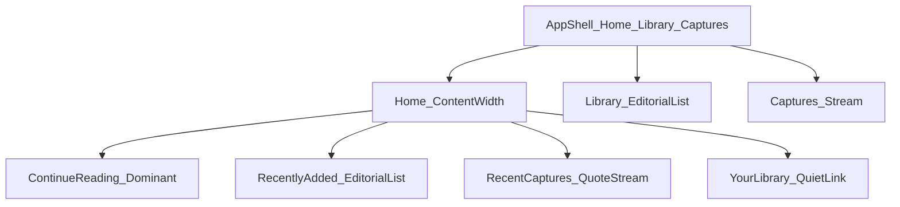

# Milestone 4 — Product Experience Plan

**Status: approved and frozen.**

This document is the single source of truth for Milestone 4 Product Experience.
Implementation must follow it. Do not reinterpret philosophy, expand scope, or
change frozen Milestone 1/2 APIs without explicit approval.

Change control: revise this plan only when a demonstrated product or
accessibility gap requires it—not for aesthetic preference or convenience.

# Milestone 4 — Product Experience plan

**Scope:** Signed-in product UX only. Auth, Supabase persistence, RLS, and frozen Milestone 1/2 component APIs stay as they are.  
**Binding philosophy:** Alostra is the private home for everything a user reads. Every visual element supports reading or disappears. Bookmark Thread remains the signature motif—never decoration.

### Design principles (Milestone 4)

#### Whitespace over density

Alostra should optimize for breathing room rather than maximum information density.

If reducing whitespace only allows displaying more cards, keep the whitespace.

The product should never feel crowded merely to expose more content.

Whitespace is considered part of the reading experience, not unused space.

#### Micro-interactions over animations

The product should avoid decorative animation.

However, meaningful state changes should feel intentional.

Examples include:

- saving a book
- updating reading progress
- marking a book as finished
- creating a capture
- deleting an item
- successful form submission

These interactions should provide subtle, purposeful feedback.

Avoid cinematic transitions, large motion, or animation for decoration.

Respect `prefers-reduced-motion`.

#### Recognition before information

Users should immediately recognize where they are through composition, hierarchy, and visual rhythm, before reading explanatory text.

Hierarchy should communicate page purpose before labels explain it.

---

## 1. Diagnosis — why it feels generic

The current authenticated app is **structurally correct** (continue → recent → captures; unified library; quote-first captures) but **compositionally ordinary**:

- **Equal SaaS scaffolding:** Library and Home both default to the same responsive **card grid** (`sm:2` / `lg:3`), so books, articles, and “recently added” read like a catalogue, not a reading room.
- **Admin vocabulary:** Continue CTAs say “Update progress” / “Open details”; forms and deletes still sound like CRUD; capture delete still mentions “this device.”
- **Mood-narration:** Home support lines and section descriptions explain calmness (“The thing you are most likely here for”) instead of letting hierarchy do the work.
- **Incomplete Thread story:** Thread appears only via active nav + progress bars + “reading” badges. Selection (`Card selected`) is unused; no disciplined “where you are” on Home.
- **Measure mismatch:** Docs intend Home at **content width**; [`home/page.tsx`](src/app/(app)/home/page.tsx) uses `PageContainer` (library width), so Home feels like a dashboard strip.
- **Loading flash:** `useLiveQuery` shows empty subsections while loading—feels unfinished, not refined.
- **Library header violates composition rule:** Two CTAs forced into `SectionHeading.action` (frozen: one action).
- **Articles look like bookmarks:** URL stuffed into `ArticleCard.excerpt` in grids, competing with the reading title.
- **Shell icon mismatch:** Library uses `QueueIcon` (docs’ “Queue” metaphor leftover), slightly SaaS-generic.

None of this requires new fonts, gradients, or components—only hierarchy, measure, copy, and Thread discipline.

---

## 2. Preserve — what already feels Alostra

- Frozen **Fraunces / Geist** split and token materials.
- Frozen cards: `ContinueReadingCard`, `BookCard`, `ArticleCard`, `CaptureCard`, `BookCover` fallback plate.
- **Continue-first** Home intent; unified books + articles + captures mental model.
- Capture as **serif quotation + source figcaption**.
- Shell IA: plain labels **Home · Library · Captures** (no metaphor destinations).
- Quiet privacy positioning without social/gamification.
- Form measure: `ContentContainer` + `max-w-reading`.
- Auth/persistence architecture (out of scope).

---

## 3. Home redesign

**Question answered:** “What should I return to?”

**Continue philosophy:** The dominant Continue Reading area should feel like returning to an unfinished thought—not opening a dashboard widget or statistics card. Composition and hierarchy carry that sense; avoid language that implies metrics, summaries, or admin status.

**Measure:** Prefer `ContentContainer` for the Home body (content width). Keep library-width only for Library browsing.

**Hierarchy (exact order):**

1. **Continue reading** (dominant)
   - No decorative eyebrow stack. Page title: serif, short—“Continue reading” as the H1 (or H1 = title of current item via continue card; page label quiet).
   - Single `ContinueReadingCard` when an in-progress item exists.
   - CTA labels: **“Continue”** for books and articles (not “Update progress” / “Open details”). Still navigates to existing edit routes until a reader exists—honest for V1, non-admin tone.
   - Empty continue: one quiet line + link to Library—not a bordered “admin empty” competing with the hero.

2. **Recently added**
   - Unified books + articles, chronological.
   - **Not** a 3-column catalogue grid. Use a **vertical stack** (books: `BookCard layout="row"`; articles: `ArticleCard` full-width in the same stack). Cap ~6.
   - Omit URL as excerpt on Home; show source/site only.
   - Section action: single quiet text control “Library”.

3. **Recent captures**
   - Up to ~4 `CaptureCard`s in a single column at content/reading measure.
   - Source must remain visible; no PKM chrome.
   - Section action: “Captures”.

4. **Your Library**
   - Final quiet entry: one short line + primary-quiet link into `/library`—not a widget, stats strip, or card grid of counts.

**Copy rules:** Remove mood-narration and privacy sermons from Home body. Empty whole-home state: factual—“Nothing here yet” + one CTA to Library. Do not describe calmness.

**Loading:** Show `Skeleton` for continue + list rows; never flash “Nothing in progress” during load.

**Responsive:** Continue card full content width; stacks stay single-column on mobile; generous `space-y-section` (whitespace over density); no decorative entrance animations. Meaningful save/progress feedback may use subtle micro-interactions only.

**Thread:** Progress on continue card only; do not add decorative Thread beside the H1.

---

## 4. Library redesign

**Mental model:** One collection of reading relationships—not a DB table, not ecommerce.

**Browsing model (Version 1 default):**
- Version 1 defaults to an **editorial list** (vertical). This is a deliberate product decision for V1—not a permanent commitment that forever excludes other browsing modes.
- Future versions may introduce additional browsing modes (for example Compact List or Covers) if they genuinely improve the reading experience. Those modes are **not** designed in Milestone 4.
- For V1: books use `BookCard layout="row"` (cover + title + quiet status + progress thread when meaningful).
- For V1: articles use `ArticleCard` in the same list rhythm (source icon + title + site/author; **do not** use raw URL as excerpt in the default list).
- Distinguishability: cover vs source icon; status vocab (Want to read / Saved / Reading / Finished)—same library, different material.

**Open question resolution (M4):**
- **Do not** build skeuomorphic shelves or spine primitives.
- V1 unified language = **shared list rhythm + typography**, not pamphlet spines. Spine/shelf layout and alternate browsing modes stay deferred beyond M4.

**Filters / search:**
- Keep All / Books / Articles as quiet `ghost`/`quiet` text controls (not pill clusters).
- Search remains; place toolbar as one calm band under the title.
- `SectionHeading`: title “Library”, short factual description, **one** action—“Add book”. Place “Add article” as a secondary control **beside** the heading row via page layout (not a second slot in `action`).

**Status / progress:**
- `emphasis` badge **only** for currently reading.
- Finished → quiet `status` tone; want-to-read/saved → omit badge or `neutral` metadata.
- Progress Thread only when status is reading (or finished with meaningful progress)—hide for untouched want-to-read.

**Covers:** Keep intentional `BookCover` fallback plate; never empty broken-image UI. Remote hosts remain out of scope unless already configured.

**Empty / no matches:** Keep EmptyState; tighten copy (no “database” language).

---

## 5. Captures redesign

**Philosophy:** Captures are not merely notes. They are intentionally kept fragments of a reading life. The page should feel like revisiting meaningful passages—not browsing a database of annotations. Do not transform Captures into a knowledge-management product.

**Feel:** Quote first, note second, source always tethered. Valuable without becoming a PKM graph.

**Hierarchy:**
1. Page title “Captures” (serif via SectionHeading) + one action “Add capture”.
2. Quiet search.
3. Vertical stream of `CaptureCard` at `max-w-content` (or reading measure)—not a wide dashboard grid.

**Typography:** Quote stays serif (component default); note muted sans; source figcaption compact. No knowledge-graph UI.

**Interaction:** Card remains whole-card link to edit. Optional `selected` on edit page if a preview is shown; list stays unselected.

**Thread:** Only via capture `selected` when that state is real—not on every list item.

**Copy fixes:** Delete dialog must not say “this device”; use account-safe wording (“This cannot be undone.”).

---

## 6. App shell / navigation

**Keep:** Home · Library · Captures; plain labels; desktop sticky sidebar; mobile bottom bar; email + Sign out.

**Changes:**
- Library icon: `BookIcon` instead of `QueueIcon` (icon accuracy; no new icons).
- Brand line “Your reading corner” may stay (approved vocabulary)—do not expand into spiritual taglines.
- Active Thread on nav items stays (reserved role #1).
- No new destinations (no Queue, Settings, Stats).
- Sign-out remains peripheral (sidebar foot / mobile header)—never a hero control.

---

## 7. Forms

Routes: book/article/capture new + edit.

**Keep:** Field set (no new fields); native selects via existing app-local `StatusField` / `SourceSelectField`; `ConfirmationDialog` for deletes.

**Improve (composition/copy only):**
- Group: identity fields first (title/author/url), then status/progress, then optional extras (cover, note).
- Primary CTA one clear verb (“Save book”); Cancel ghost; Delete quiet + confirm.
- Descriptions: factual milestone limits only where needed (no extraction)—shorter.
- Fix capture delete “device” copy.
- Mobile: single column; 16px inputs already frozen; sticky actions not required if row wraps cleanly.

---

## 8. Typography (page-level)

| Surface | Treatment |
|---------|-----------|
| Page / section titles | Serif (`SectionHeading` / Home H1) |
| Book & article titles | Serif (card defaults) |
| Capture quotes | Serif |
| Nav, filters, buttons, forms, metadata | Sans |
| Status labels | Sans, small; never the only state carrier |

Do **not** introduce new fonts. Prefer less supporting paragraph text under titles.

---

## 9. Bookmark Thread system

**Approved roles (unchanged freeze):**

1. Active navigation  
2. Reading progress (`ProgressBar` extent = progress)  
3. Selected book (`Card selected`) — use when a screen has a true selection  
4. Selected capture — same  
5. Important emphasis (`Badge tone="emphasis"` = currently reading)

**M4 encoding decision:** Length already encodes progress via `ReadingProgress`. **Do not** introduce opacity-for-recency in M4 (still deferred).

**Do not use Thread for:** section underlines, empty-state decoration, form accents, marketing flourishes, every list row.

---

## 10. Empty / loading / error

| State | Treatment |
|-------|-----------|
| Loading lists/home | `Skeleton` blocks matching layout; no false empties |
| Empty library/home/captures | `EmptyState` + one clear CTA; factual copy |
| Not found (edit) | Short message + back link (existing pattern) |
| Save failures | Toast (existing); surface safe message when useful |
| Auth errors | Unchanged (out of scope) |

No spinners; no decorative entrance choreography. Meaningful state changes (save, progress, finish, capture create/delete, form success) may use subtle micro-interactions only. Respect `prefers-reduced-motion`.

---

## 11. Mobile (route-by-route)

| Route | Intent |
|-------|--------|
| Home | Continue full-bleed within gutters; stacks single-column; bottom nav clear of content (`pb` already) |
| Library | Row cards stack; toolbar stacks search then filters; touch targets ≥ 44px on filters |
| Captures | Single-column stream; search full width |
| Forms | One column; actions wrap; dialogs full usable width |
| Shell | Keep bottom nav; avoid competing sticky headers beyond brand/sign-out |

Do not invent a separate mobile IA.

---

## 12. Accessibility

**Risks to watch:**
- Removing status badges must not remove accessible status text (keep text in card metadata or `aria` where needed).
- Skeleton must not trap focus or announce misleading emptiness.
- List-vs-grid change: preserve heading levels on cards (`headingLevel`).
- Filter `aria-pressed` stays.
- Thread/progress already expose progressbar semantics—keep.
- Contrast: never place olive `status` badges on `surface-sunken`.
- Focus rings unchanged; no color-only state.

---

## 13. Frozen-system blockers

**None required.** Milestone 4 ships by composition:

- Home measure → `ContentContainer`
- Library dual CTAs → layout outside `SectionHeading.action`
- List browsing → `BookCard layout="row"` + stacked `ArticleCard`
- Continue labels → `actionLabel` prop
- Library icon → existing `BookIcon`

Do not change frozen component APIs for aesthetics.

---

## 14. Routes / files expected to change

| Area | Files |
|------|--------|
| Shell | [`src/app/_components/app-shell.tsx`](src/app/_components/app-shell.tsx) |
| Home | [`src/app/(app)/home/page.tsx`](src/app/(app)/home/page.tsx) |
| Library | [`src/app/(app)/library/page.tsx`](src/app/(app)/library/page.tsx) |
| Captures | [`src/app/(app)/captures/page.tsx`](src/app/(app)/captures/page.tsx) |
| Forms | `library/books/**`, `library/articles/**`, `captures/new`, `captures/[id]/edit` |
| Docs | [`docs/ux-decisions.md`](docs/ux-decisions.md) (new § Milestone 4), light README roadmap touch |
| Optional helper | [`src/app/_components/use-live-query.ts`](src/app/_components/use-live-query.ts) only if loading UX needs a tiny affordance—prefer page-level Skeleton usage without API change |

No Supabase/auth/middleware/repository behavior changes unless a copy string lives there (none expected).

---

## 15. Components to reuse per route

| Route | Reuse |
|-------|--------|
| Home | `ContentContainer`, `ContinueReadingCard`, `BookCard` (row), `ArticleCard`, `CaptureCard`, `SectionHeading`, `EmptyState`, `Button`, `Skeleton` |
| Library | `PageContainer`, `BookCard` (row), `ArticleCard`, `SearchInput`, `SectionHeading`, `Button`, `EmptyState`, `Skeleton` |
| Captures | `PageContainer` or `ContentContainer`, `CaptureCard`, `SearchInput`, `SectionHeading`, `EmptyState`, `HighlightIcon`, `Skeleton` |
| Forms | `ContentContainer`, `Input`, `Textarea`, `Button`, `SectionHeading`, `ConfirmationDialog`, `useToast` + app-local `StatusField` / `SourceSelectField` |
| Shell | `SidebarItem`, `MobileNavItem`, `NavigationGroup`, `Button`, `BookIcon`, `HomeIcon`, `InboxIcon` |

---

## 16. Page-local components (create only if reuse warrants)

Prefer keeping logic in page files. Create thin locals only if duplication appears:

- `src/app/_components/library-item-list.tsx` — shared book-row + article stack for Home recent + Library
- `src/app/_components/page-header-actions.tsx` — one primary + one secondary control beside titles (Library add book/article)

No new frozen primitives.

---

## 17. Implementation order

1. Document M4 intent in `docs/ux-decisions.md` (acceptance binding).
2. App shell icon + any shell copy trim.
3. Home hierarchy, measure, Skeletons, CTAs, Your Library entry.
4. Library list model, toolbar, single primary heading action, status/progress discipline.
5. Captures stream + delete copy fix.
6. Forms grouping/copy pass.
7. Cross-route empty/loading polish + a11y pass.
8. Lint, `tsc`, tests, production build; manual desktop + mobile review.

---

## 18. Acceptance criteria

- Signed-in Home answers “what should I return to?” with dominant Continue, then Recent, Captures, quiet Library entry.
- Home uses content-width composition; no 3-column catalogue as the primary Home pattern.
- Library V1 defaults to a unified editorial list (not locked forever against future modes); books and articles distinguishable; filters/search remain quiet.
- Captures remain quote-first kept fragments with clear source; not a notes database or PKM.
- Nav stays Home / Library / Captures with accurate icons; Thread only in reserved roles.
- No frozen API changes; no new fonts; no auth/persistence redesign.
- Loading never flashes false empties; reduced motion respected.
- Copy has no spiritual/SaaS/dashboard language; no streaks/stats/AI.
- Lint, typecheck, tests, build pass.

---

## 19. Explicit do not build

AI, recommendations, reminders, streaks, goals, social, dashboards, charts, analytics UI, EPUB/PDF readers, offline sync, new backend/auth, payments, Notion/Obsidian, spine/shelf skeuomorphism, new fonts, ornamental gradients, OAuth, gamification, metaphor nav labels, entrance page animations.

---

## 20. What makes it recognizably Alostra

Not decoration—**judgment**: continue-first hierarchy at reading measure (unfinished thought, not a dashboard widget); V1 editorial list for a single reading life; captures as intentionally kept fragments with sources; Thread only where place/progress/selection matters; serif for what is read and sans for what controls; whitespace over density; recognition before information; micro-interactions over decorative animation; material restraint from the frozen system; silence where SaaS products shout.

